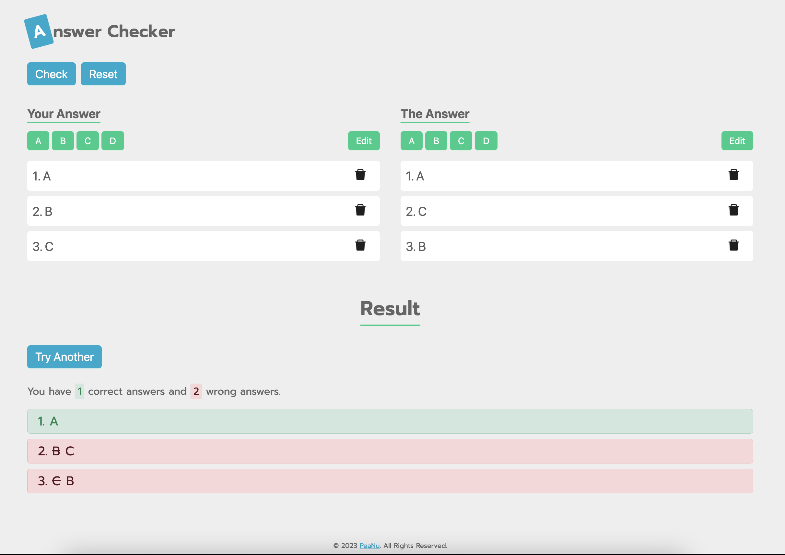

# Answer Checker

## Overview



Answer Checker 是一個幫你快速對答案的線上服務，有下面幾個特色：

- 支援跨平台使用（手機、瀏覽器）
- 快速上手的操作介面（快速填入答案及拖拉調整）
- 明確的分析結果（告訴你正確及錯誤的數量、錯誤題數以及正確解答）

網站連結：[https://jubeatt.github.io/answer-checker/](https://jubeatt.github.io/answer-checker/)

## Development

- Node Version: v14.21.2
- React v17
- Ant Design v5
- lodash
- sortablejs
- uuid

1\. install dependencies

```bash
npm ci
# or
npm install
```

2\. run dev server

```bash
npm run dev
```

3\. deploy to github

```
npm run deploy
```
